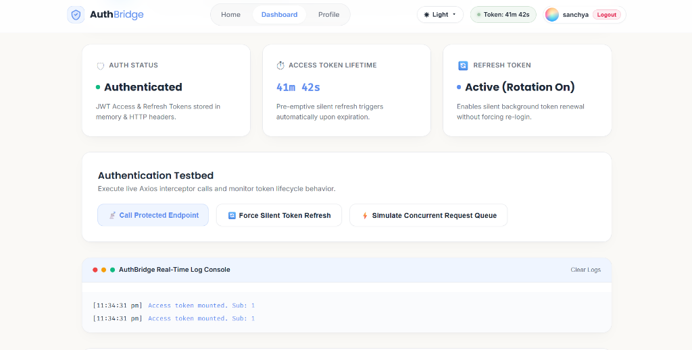

# 🔐 AuthBridge

<div align="center">

### **Secure Access. Seamless Sessions.**

A modern **JWT Authentication** application built with **React** and **Vite** that demonstrates secure login, protected routing, automatic token refresh, intelligent request queuing, and seamless session management through a clean, responsive, and interactive user interface.


</div>

---

# 📖 About the Project

AuthBridge is a production-inspired authentication application that demonstrates how modern web applications securely manage user authentication and sessions. Built with **React**, **Vite**, and **JWT Authentication**, the project focuses on delivering a secure, scalable, and user-friendly authentication workflow.

The application supports secure login, protected routes, automatic access token refresh, intelligent request queuing, and immediate session cleanup during logout. Instead of interrupting users when an access token expires, AuthBridge silently refreshes the token in the background while temporarily queuing API requests, creating a smooth and uninterrupted user experience.

Beyond authentication, the application provides a responsive interface with multiple themes, interactive particle animations, and reusable React components that follow modern frontend development practices.

---

# ✨ Features

- 🔐 Secure JWT Authentication
- 🔄 Automatic Access Token Refresh
- 🔒 Protected Routes
- ⚡ Request Queue Management
- 👤 User Session Management
- 🎨 Dynamic Theme Switching
- ✨ ReactBits Particle Animation
- 📱 Responsive Design
- 🚀 Fast Performance with Vite
- 🧩 Component-Based Architecture

---

# 🎯 Project Highlights

- Production-inspired authentication workflow
- Secure JWT session management
- Automatic token renewal
- Queue handling for concurrent API requests
- Theme-aware responsive interface
- Smooth animations using ReactBits
- Clean and reusable React architecture
- Modern UI focused on user experience

---

# 🛠️ Tech Stack

<div align="center">

| Category | Technologies |
|-----------|--------------|
| 🎨 **Frontend** | React, Vite, JavaScript (ES6+), CSS3 |
| 🔐 **Authentication** | JWT Authentication, Access Token, Refresh Token |
| 🔄 **State Management** | React Context API |
| 🌐 **Routing** | React Router DOM |
| 📡 **API Communication** | Axios, Axios Interceptors |
| 🎭 **UI & Animations** | ReactBits, OGL, CSS Animations |
| 📱 **Design** | Responsive Design, Theme Switching |
| 🚀 **Deployment** | Vercel |
| 💻 **Version Control** | Git & GitHub |

</div>

---

# 📂 Project Structure

```text
AUTHBRIDGE/
│
├── dist/
│   ├── assets/
│   ├── images/
│   ├── app.js
│   ├── auth.js
│   ├── script.js
│   ├── style.css
│   └── index.html
│
├── node_modules/
│
├── public/
│   ├── images/
│   ├── app.js
│   ├── auth.js
│   ├── script.js
│   ├── style.css
│   └── index.html
│
├── screenshots/
│   └── dashboard.png
│
├── src/
│   ├── api/
│   ├── components/
│   ├── context/
│   ├── pages/
│   ├── routes/
│   ├── utils/
│   ├── App.jsx
│   ├── main.jsx
│   └── index.css
│
├── build_and_run.ps1
├── httplib.h
├── server.cpp
├── index.html
├── package.json
├── package-lock.json
├── vite.config.js
└── README.md
```

---

# 🔄 Authentication Flow

```text
User Login
     │
     ▼
JWT Access Token + Refresh Token
     │
     ▼
Protected Routes
     │
     ▼
Access Token Expires
     │
     ▼
Silent Refresh Request
     │
     ▼
Queue Pending API Calls
     │
     ▼
New Access Token Received
     │
     ▼
Replay Queued Requests
     │
     ▼
Continue Session

        OR

Refresh Failed
     │
     ▼
Logout + Redirect to Login
```

---

# 📸 Application Preview

## Dashboard

Save your screenshot inside:

```
screenshots/
└── dashboard.png
```

Then GitHub will automatically display it.



---

# 🚀 Getting Started

## 1️⃣ Prerequisites

Make sure the following are installed:

- Node.js (v18 or higher)
- npm

---

## 2️⃣ Installation

Install project dependencies:

```bash
npm install
```

Install OGL for the particle animation:

```bash
npm install ogl
```

---

## 3️⃣ Development Server

Run the Vite development server:

```bash
npm run dev
```

Open:

```
http://localhost:5173
```

---

## 4️⃣ Build for Production

Create the optimized production build:

```bash
npm run build
```

The optimized files will be generated inside the **dist/** folder.

---

# 🌐 Deployment (Vercel)

This project is ready for deployment on **Vercel**.

### Initialize Git

```bash
git init
git add .
git commit -m "AuthBridge production release"
```

### Push to GitHub

```bash
git branch -M main
git remote add origin https://github.com/YOUR_USERNAME/AuthBridge.git
git push -u origin main
```

Finally, import your repository into **Vercel** to deploy automatically.

---

# ✅ Requirements & Evaluation Checklist

| Requirement | Status |
|-------------|:------:|
| JWT Authentication | ✅ |
| Store Access & Refresh Tokens | ✅ |
| Automatic Token Refresh | ✅ |
| Queue API Requests During Refresh | ✅ |
| Prevent Duplicate Refresh Calls | ✅ |
| Protected Routes | ✅ |
| Redirect Only After Refresh Failure | ✅ |
| Immediate Logout Handling | ✅ |

---

# 📚 Key Concepts Implemented

- ✅ JWT Authentication
- ✅ Access & Refresh Token Management
- ✅ Protected Routing
- ✅ Silent Token Refresh
- ✅ Axios Interceptors
- ✅ Request Queue Handling
- ✅ Session Persistence
- ✅ React Context API
- ✅ Theme Switching
- ✅ Responsive Design
- ✅ Component-Based Architecture

---

# 🔮 Future Enhancements

- 🔐 Role-Based Access Control (RBAC)
- 📧 Email Verification
- 🔑 Multi-Factor Authentication
- 🌐 Social Login
- 📊 Session Activity History
- 🔔 Notification System
- ♿ Accessibility Improvements

---

# 🤝 Acknowledgements

This project was developed as part of a frontend authentication assignment to demonstrate secure authentication workflows and modern React development practices.

Special thanks to the amazing open-source community and the following technologies:

- ⚛️ React
- ⚡ Vite
- 🌐 Axios
- 🔐 DummyJSON Authentication API
- ✨ ReactBits
- 🎨 OGL
- 🐙 Git & GitHub
- ▲ Vercel

Their documentation, community support, and open-source contributions made this project possible.

---

<div align="center">

## ⭐ Thank You for Visiting!

Thank you for taking the time to explore **AuthBridge**.

This project reflects my understanding of **JWT Authentication**, **React Architecture**, **State Management**, and **Modern Frontend Development**.

If you found this project interesting, consider giving it a ⭐ on GitHub.

**Secure Access. Seamless Sessions.**

</div>
